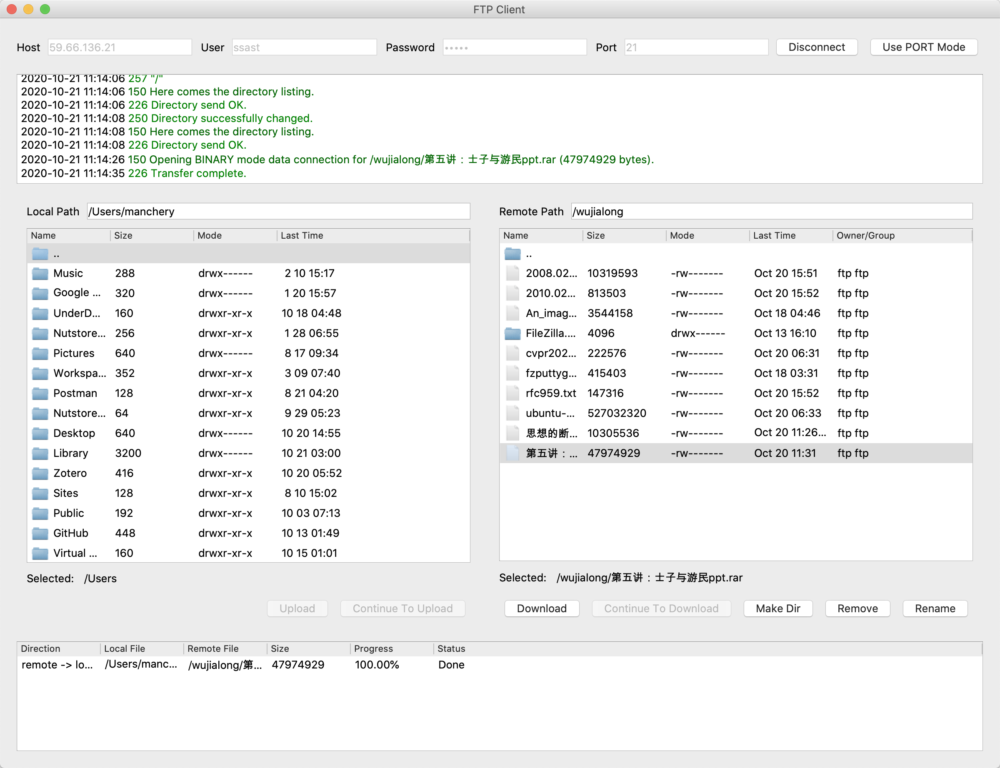

# FTP Client and Server

Jialong Wu

## Introduction

FTP socket programming for **BOTH client and server**. 

Course project for Computer Networks, instructed by [Prof. Yang](http://tns.thss.tsinghua.edu.cn/~yangzheng/).

For details, please see my report (in Chinese).

<p align="center">
  
</p>

## Server

The server is implemented using C and Berkeley Socket API, supporting:

- FTP services on specified ports and directories
- Multiple clients to connect simultaneously without blocking
- Totally 19 FTP commands: `USER, PASS, RETR, STOR, QUIT, SYST, TYPE, PORT, PASV, MKD, CWD, PWD, LIST, RMD, RNFR, RNTO, REST, DELE`
- Large file transmission
- Resume transmission from breakpoint, for both upload and download
- Connected and normally used by the following own implementation of FTP clients

### Enviroment

Linux

### Usage

Enter the directory `server`, run:

````bash
make serve
sudo ./server -port [port] -root [root]
````

The default value is `21` for `port` and `\tmp` for `root`. 

## Client

The client is implemented using Python and PyQt5 for GUI, supporting:

- FTP commands: `USER, PASS, RETR, STOR, QUIT, SYST, TYPE, PORT, PASV, MKD, CWD, PWD, LIST, RMD, RNFR, RNTO, REST, DELE`
- Connecting to and normally served by the above own implementation of FTP servers and **vsftp servers**
- Large file transmission
- Resume transmission from breakpoint, for both upload and download
- File transmission without blocking the server

### Requirements

PyQt5
### Usage

Enter the directory `client`, run:

```bash
python client.py
```
## Acknowledgement

We would like to thank Prof. Yang and TAs for their devotion to the course Computer Networks.


